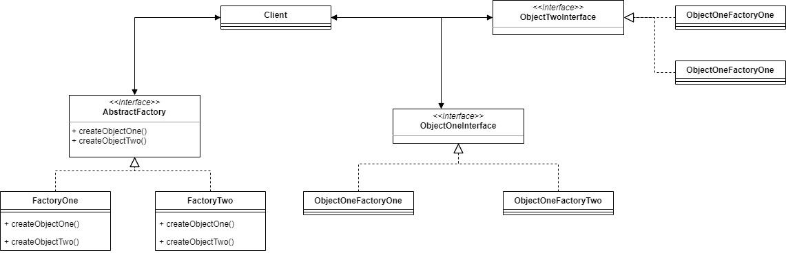
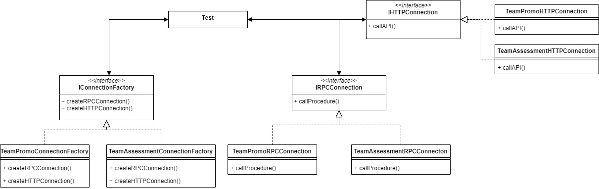

# Abstract Factory

Abstract Factory pattern work as a super-factory that creates another factories. It can be considered as another abstraction of Factory Pattern.

For example, we will make Abstract Factory for teams in a business. If we want to connect to the team and get some data or functionality of the team, we can make RPC or HTTP connection to the team.

## Source
- https://sourcemaking.com/design_patterns/abstract_factory
- https://www.geeksforgeeks.org/abstract-factory-pattern/
- https://www.tutorialspoint.com/design_pattern/abstract_factory_pattern.htm