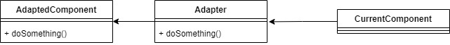
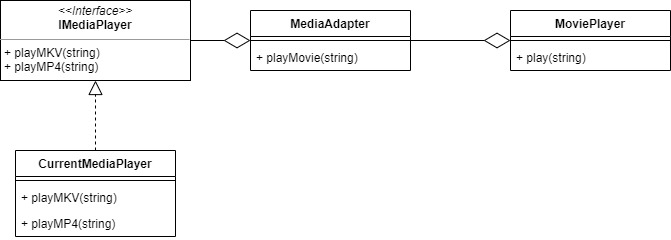

# Adapter

Adapter used when we want to join functionalities of classes with incompatible interface. With this design pattern, those classes can work together.

We will make a adapter for Media Player that enable the Movie Player to use any Media Player that exist in the system.

## Source
- https://sourcemaking.com/design_patterns/adapter
- https://www.tutorialspoint.com/design_pattern/adapter_pattern.htm