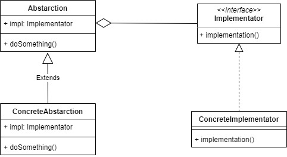
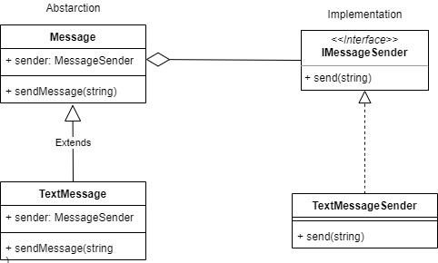

# Bridge

Bridge design pattern used when we want to decouple abstraction its implementation so both of them can vary independently.

For example, lets make Text Message object and its implementation for sending the text.

## Source
- https://www.geeksforgeeks.org/bridge-design-pattern/
- https://sourcemaking.com/design_patterns/bridge