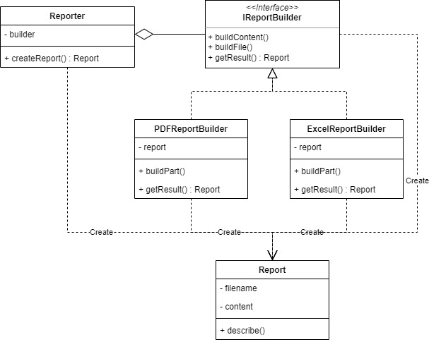

# Builder

Builder pattern enables us to builds a complex object using step by step approach. This builder is independents of other objects.

We will make an example that is Report generator. We can create the report with PDF or Excel kind of file.

