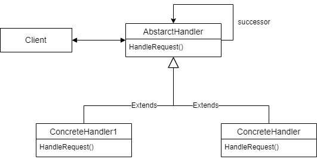

# Chain of Responsibility

Chain of Responsibility is a behavioral pattern that helps to avoid coupling by giving one or more object chance to handle request in specific manner and consequently. Chain item (the object that will be processing request) will be receiving request and after doing some logic, will passes the request to the next handler along the handlers chain. 

For example, we will built a system that will process the request from client and check the request with our checking system that using chain of responsibility. If the checking passed, then the request can be processed by the main system.

## Source
- https://itnext.io/easy-patterns-chain-of-responsibility-9a84307ad837
- https://sourcemaking.com/design_patterns/chain_of_responsibility
- https://refactoring.guru/design-patterns/chain-of-responsibility