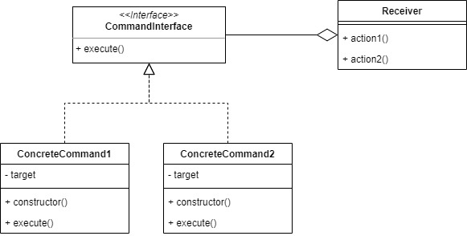
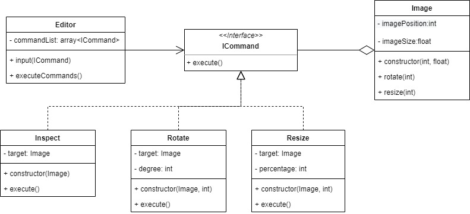

# Command

With Command pattern, we can decouples object that invokes the operation from the one who perform it. We can issue requests without knowing about the operation being requested or the receiver of request.

For the example, we will create an simple image editor and it will execute some command using Command Pattern.

## Source
- https://sourcemaking.com/design_patterns/command
- https://www.tutorialspoint.com/design_pattern/command_pattern.htm