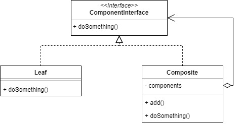
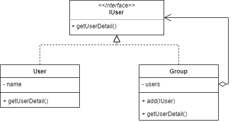

# Composite

Composite pattern used when we want to treat a group of object in similar way with a single object. It's usually used to represent tree structures of object.

For example, let's make a tree structure with User as the leaf object and Group as the Composite object.

## Source
- https://sourcemaking.com/design_patterns/composite
- https://www.geeksforgeeks.org/composite-design-pattern/
- https://www.tutorialspoint.com/design_pattern/composite_pattern.htm