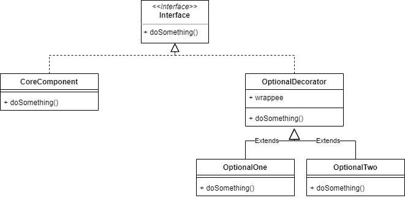
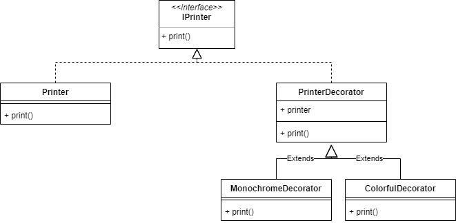

# Decorator

Decorator pattern allows us to dynamically add functionality to an object without affecting the behavior of other existing object in same class. We can use inheritance to accomplish this.

For example we will make Printer object with Decorator for how we will print the sheet.

## Source
- https://www.geeksforgeeks.org/decorator-design-pattern-in-java-with-example/
- https://sourcemaking.com/design_patterns/decorator
- https://www.tutorialspoint.com/design_pattern/decorator_pattern.htm