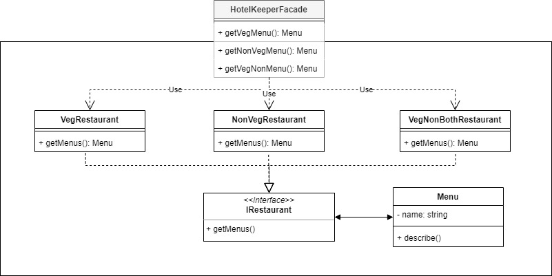

# Facade

With Facade design pattern, we can simplify interface to use a complex functionality of system.

For example, we will make a Facade of Hotel Keeper where we can choose what restaurant that the user want menu from.

## Source
- https://sourcemaking.com/design_patterns/facade
- https://www.geeksforgeeks.org/facade-design-pattern-introduction