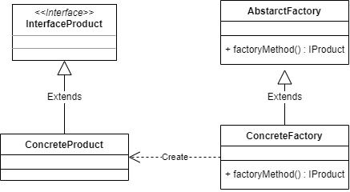
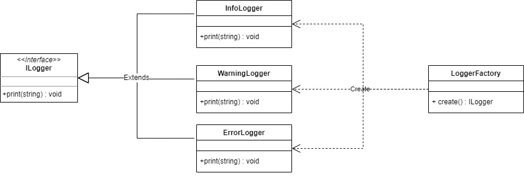

# Factory Method

Factory Method can make possible to create object without exposing the creation logic to the client and refer to newly created object using a common interface.

For example, we will built a factory method that can be generate logger according to the type of logger that we want to make.

## Source
- https://www.tutorialspoint.com/design_pattern/factory_pattern.htm
- https://sourcemaking.com/design_patterns/factory_method
- https://www.javatpoint.com/factory-method-design-pattern