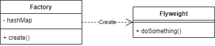

# Flyweight

Flyweight pattern is used to reduce the number of objects created and to increase performance. It will use already existing similar kind of object by storing them and creates new object when it's not found.

For example, we will make simple game that use 2 sides of player, terrorist and counter-terrorist. We will generate these players with Flyweight pattern.

## Source
- https://www.geeksforgeeks.org/flyweight-design-pattern/
- https://www.tutorialspoint.com/design_pattern/flyweight_pattern.htm