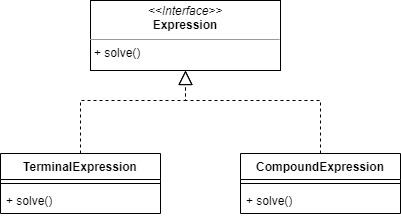
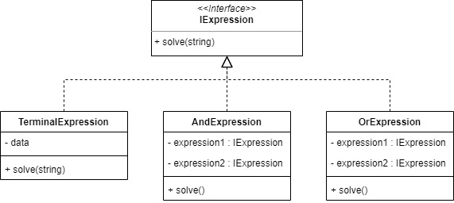

# Interpreter

Interpreter pattern used we need to evaluate language grammar or expression. This expression involving implementing an expression interface to interpret a particular context.

For example, we will make a simple branching with Interpreter.

## Source
- https://www.tutorialspoint.com/design_pattern/interpreter_pattern.htm
- https://www.geeksforgeeks.org/interpreter-design-pattern/
- https://sourcemaking.com/design_patterns/interpreter