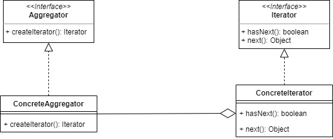
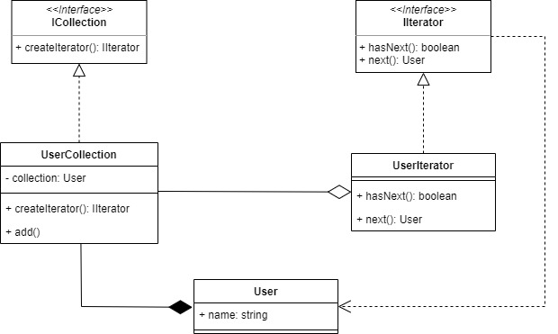

# Iterator

Iterator can be used if we want to access elements of collection object without knowing its underlying representation. 

For example, we will built a iterator that will iterate a collection of user object.

## Source
- https://www.tutorialspoint.com/design_pattern/iterator_pattern.htm
- https://www.geeksforgeeks.org/iterator-pattern/