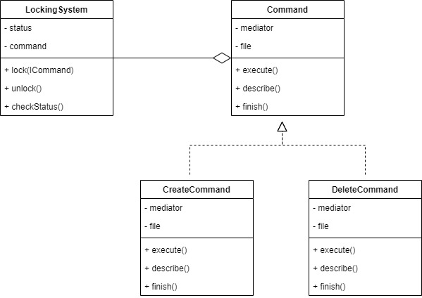

# Mediator

Mediator pattern is used to reduce communication complexity between multiple objects or classes. This pattern provides a mediator class which normally handles all the communications between different classes and supports easy maintenance of the code.

For example, we will make a locking system for commands that will affect the file.

## Source
- https://www.tutorialspoint.com/design_pattern/mediator_pattern.htm
- https://sourcemaking.com/design_patterns/mediator
- https://www.geeksforgeeks.org/mediator-design-pattern/