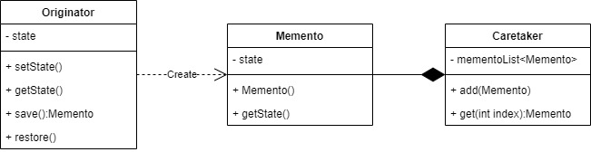

# Memento

Memento is used when we want to restore state of object to its previous state. We usually call this act as `undo` or `rollback`.

For example, we will built an simple example about editor. Like we usually do, editor always save their state and we can always undo our action to the state before. But I'm give this example a bit tweaking about indexing in its memento list, if the index is beyond the array length, then it will return the latest state.

## Source
- https://www.javatpoint.com/memento-pattern
- https://sourcemaking.com/design_patterns/memento