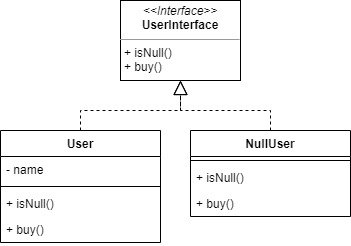

# Null Object

Null Object pattern can be used to replaces check of NULL object instance. Instead of putting if check for a null value, Null Object reflects a do nothing relationship.

For example, we will make a User object where the user can be null. If the user is null and they want to buy, then it will not be executed.

## Source
- https://www.tutorialspoint.com/design_pattern/null_object_pattern.htm
- https://www.geeksforgeeks.org/null-object-design-pattern/
- https://sourcemaking.com/design_patterns/null_object