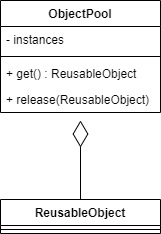
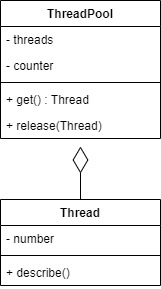

# Object Pool

Object Pool pattern is effective if used in situation where the cost of initializing a class instance is high. With this pattern, we will make a container that contains some amount of objects. So we can just take the object from the pool when we need it and put it back when we done.

For example, we will make a Thread pool, where we can get Thread object from the pool when we need it.

## Source
- https://sourcemaking.com/design_patterns/object_pool
- https://www.geeksforgeeks.org/object-pool-design-pattern/