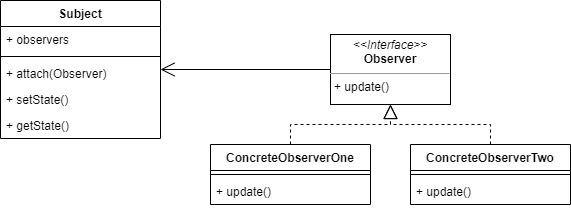
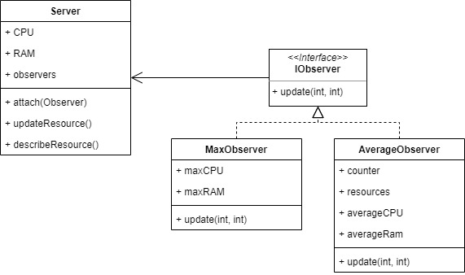

# Observer

Observer pattern is used when there is one-to-many relationship between objects such as if one object is modified, its dependent objects are to be notified automatically.

For example, lets make server monitoring system that aggregate the max and average of the system for the observer.

## Source
- https://www.tutorialspoint.com/design_pattern/observer_pattern.htm
- https://sourcemaking.com/design_patterns/observer