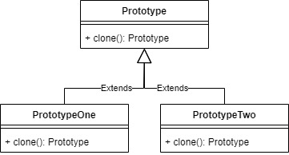
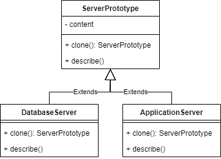

# Prototype

Prototype pattern allow us to copy an existing object rather than creating new instance from scratch. This pattern usually used because creating new object from scratch considered as a costly operation.

For example, we will make Prototype for cloning server for database or application.

## Source
- https://www.geeksforgeeks.org/prototype-design-pattern/
- https://www.tutorialspoint.com/design_pattern/prototype_pattern.htm
- https://sourcemaking.com/design_patterns/prototype