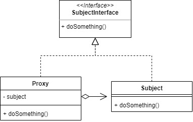
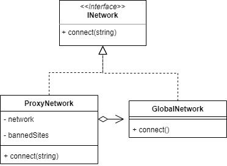

# Proxy

Proxy pattern enables us to represent functionality of another class. We provide a surrogate or placeholder of another object to control access to it.

For example we will make Proxy for Networking. So if we want to connect to the Global Network, we must pass the Proxy first.

## Source
- https://www.tutorialspoint.com/design_pattern/proxy_pattern.htm
- https://www.geeksforgeeks.org/proxy-design-pattern/
- https://sourcemaking.com/design_patterns/proxy