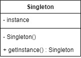
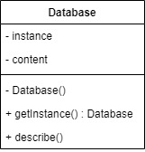

# Singleton

Singleton design pattern can be used if we only need one instance of object. At first time we accessed the instance, we need to make the object first, then in the next time we need the instance, we just need to use the instance that we create at first.

For example, we will make Singleton pattern for Database object.

## Source
- https://www.tutorialspoint.com/design_pattern/singleton_pattern.htm
- https://sourcemaking.com/design_patterns/singleton