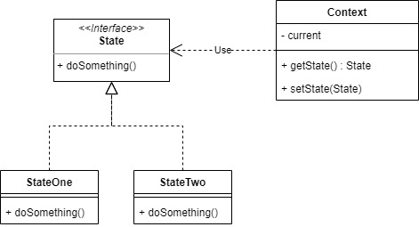
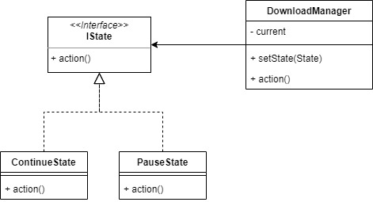

# State

State pattern used when an object changes its behavior based on its internal state.

For example, we will make a simple download manager where we control the state of continuity of the download.

## Source
- https://www.tutorialspoint.com/design_pattern/state_pattern.htm
- https://www.geeksforgeeks.org/state-design-pattern/
- https://sourcemaking.com/design_patterns/state