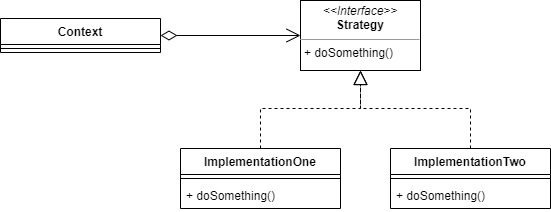

# Strategy

Strategy pattern create objects which represent various strategies and a context object whose behavior varies as per its strategy object. The strategy object changes the executing algorithm of the context object.

For example, lets make login system that will using own login system or with other authentication like Google or Facebook.

## Source
- https://www.geeksforgeeks.org/strategy-pattern-set-1/
- https://www.tutorialspoint.com/design_pattern/strategy_pattern.htm
- https://sourcemaking.com/design_patterns/strategy