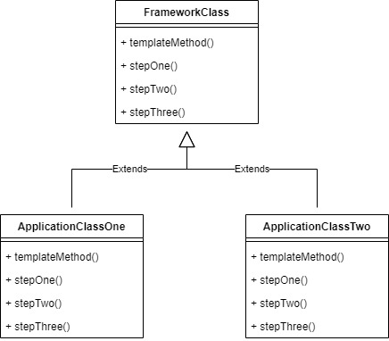
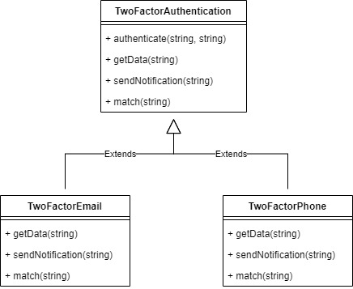

# Template Method

Template Method pattern is to define an algorithm as a skeleton of operations and leave the details to be implemented by the child classes. The overall structure and sequence of the algorithm are preserved by the parent class. 

For example, we will make a template method for two factor authentication, we can choose to use email authentication or phone authentication.

## Source
- https://www.tutorialspoint.com/design_pattern/template_pattern.htm
- https://sourcemaking.com/design_patterns/template_method
- https://www.geeksforgeeks.org/template-method-design-pattern/