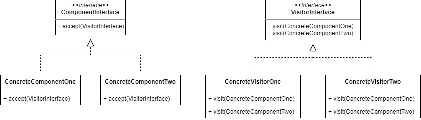
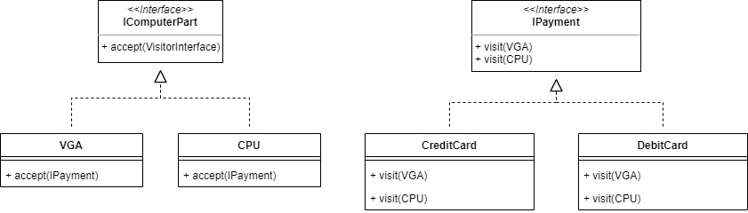

# Visitor

Visitor pattern is used when we have to perform an operation on a group of similar kind of Objects. With the help of visitor pattern, we can move the operational logic from the objects to another class.

For example, we will make a payment system when buying computer parts.

## Source
- https://www.tutorialspoint.com/design_pattern/visitor_pattern.htm
- https://www.geeksforgeeks.org/visitor-design-pattern/
- https://sourcemaking.com/design_patterns/visitor